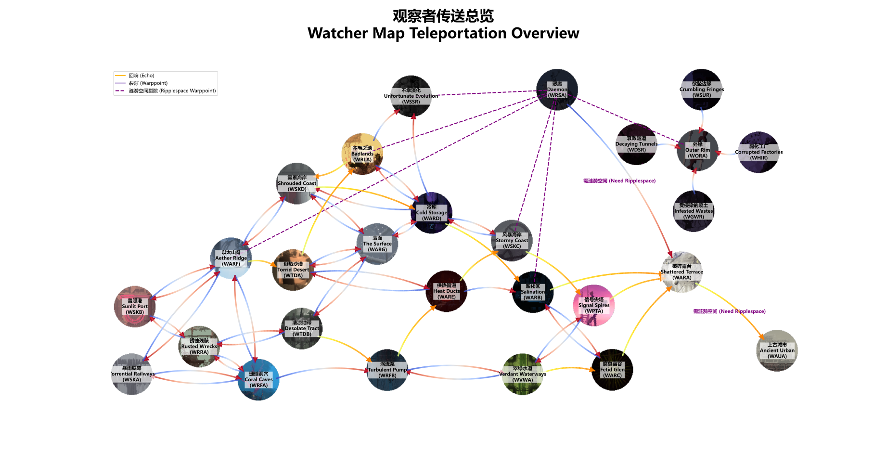
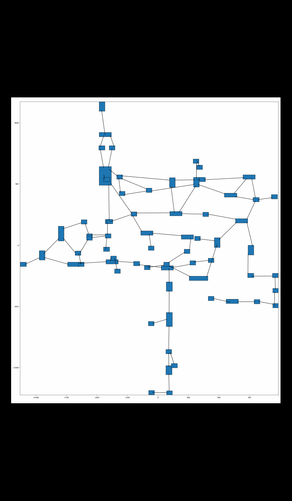
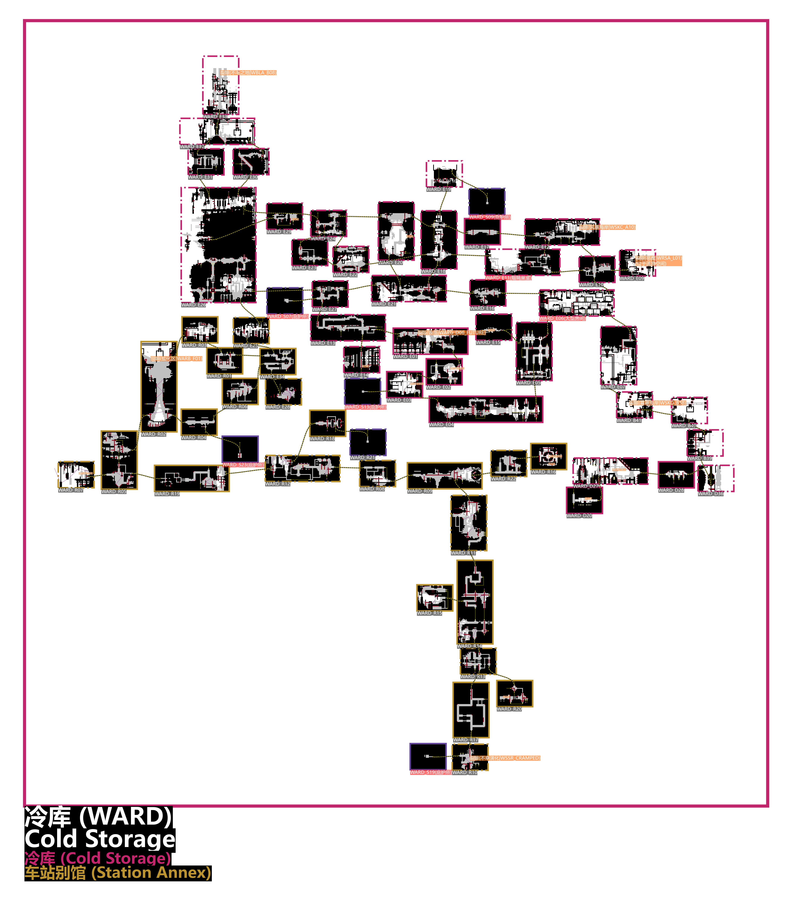
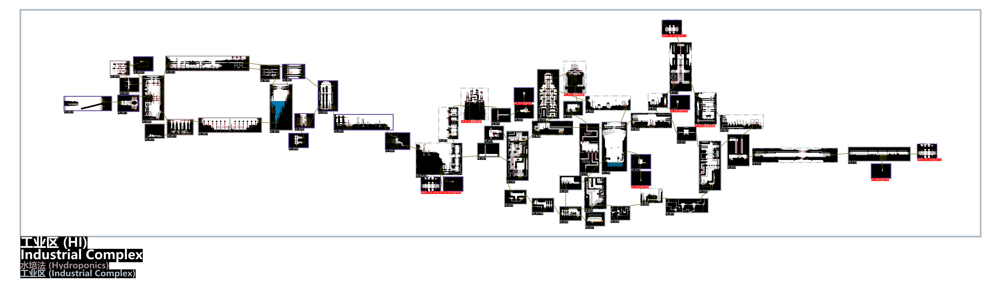
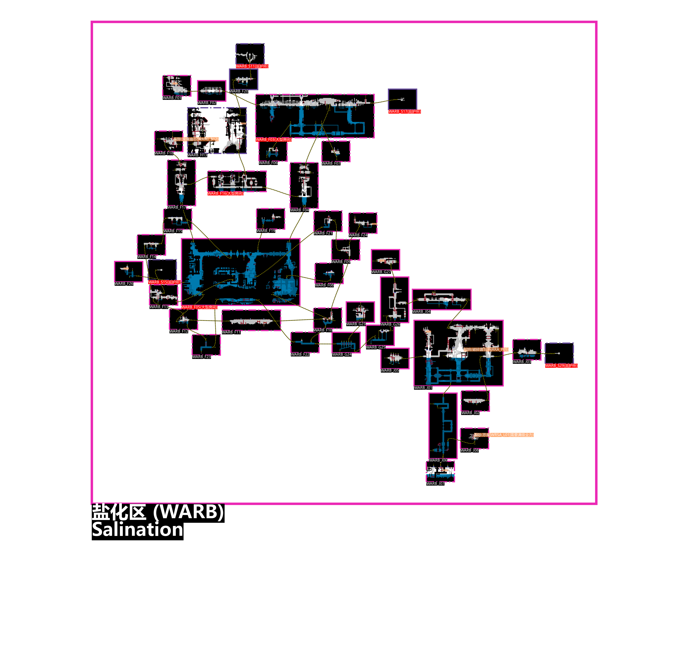

## 观察者传送总览

## 特点

* 基于算法自动排布地图位置
* 支持渲染
  * 沙子（`TerrainHandle`）
  * 贴壁长腿菌可以攀爬的长触手（ `CorruptionTube`）
* 支持区域
  * 观察者的工业区子区域`水培法`
* 标注
  * 回响位置
  * 传送点位置
  * 珍珠、业力花位置
  * 房间类型（比如`庇护所`）
  * 房间编号

## 备注

* Watcher中，World文件的查找顺序很可能是`watcher`，`原版`，`moreslugcat`。
* 腐化原版世界的裂隙传送到外缘时，到达房间有随机性，`WORA_START`只是可能到达的房间之一。

## 链接

### 地图生成器

* 带有UI的地图编辑器——[Cornifer](https://github.com/Ved-s/Cornifer)
* [Cornifer](https://github.com/Ved-s/Cornifer)适配Watcher的[分支](https://github.com/enchanted-sword/Cornifer)

### 地图格式文档

* [Creating A Region - Rain World Modding](https://rainworldmodding.miraheze.org/wiki/Creating_A_Region)
* [World File Format - Rain World Modding](https://rainworldmodding.miraheze.org/wiki/World_File_Format)
* [Level Editor - Rain World Modding](https://rainworldmodding.miraheze.org/wiki/Level_Editor)

## 参考效果

### 排布算法动画

### 工业区

### 盐化区

