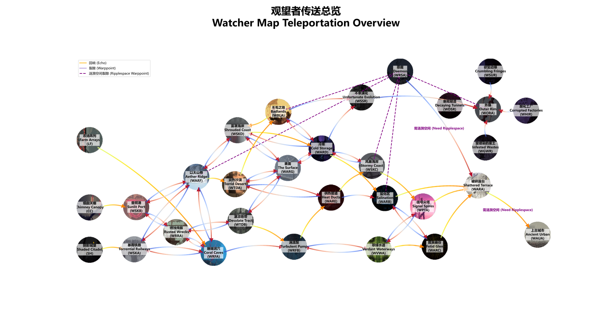

https://rainworldmodding.miraheze.org/wiki/Creating_A_Region

https://rainworldmodding.miraheze.org/wiki/World_File_Format

https://rainworldmodding.miraheze.org/wiki/Level_Editor

* Watcher中，World文件的查找顺序是`watcher`，`moreslugcat`，`原版`。
* 去往外缘的传送房间不固定