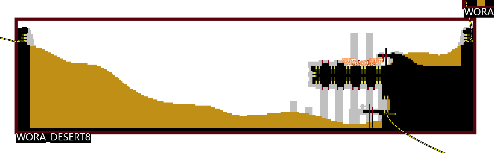
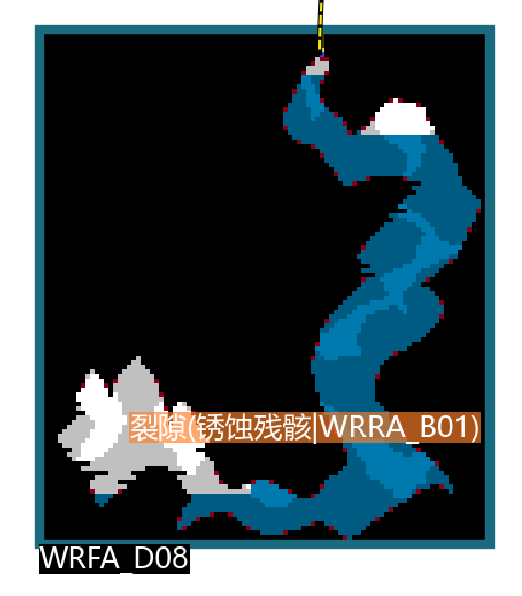
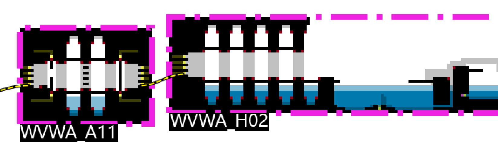
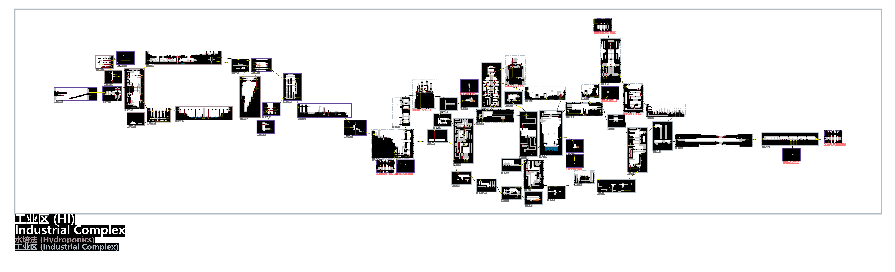

# **CN** | [EN](readme_en.md)

## 观望者传送总览

## 特点

* 基于算法自动排布地图位置
* 支持渲染
  * 沙子（`TerrainHandle`）
  * 贴壁长腿菌可以攀爬的长触手（ `CorruptionTube`）
  * 酸液（`LethalWater`和`Toxic Brine Water`）
  * 水中的空气区域（`AirPocket`, `WaterCutoff`）
  * 浮动水位（`WaterFluxMinLevel`、`WaterFluxMaxLevel`、`WaterCycleTop`、`WaterCycleBottom`）
  * 腐化墙壁（`Corruption`）
* 支持区域
  * 观察者的工业区子区域`水培法`
* 标注
  * 回响位置
  * 传送点位置
  * 珍珠、业力花位置
  * 房间类型（比如`庇护所`）
  * 房间编号

## 备注

* Watcher中，World文件的查找顺序很可能是`watcher`，`原版`，`moreslugcat`。
* 腐化原版世界的裂隙传送到外缘时，到达房间有随机性，`WORA_START`只是可能到达的房间之一。
  * 去往恶魔的到达房间似乎也有随机性

### TODO

- [ ] `WAUA_BATH`到`WAUA_TOYS`的回响传送位置有点不准确

## 链接

* [雨世界RWE+地图编辑器教程：4.使用开发者工具对地图进行深层次加工_游戏热门视频](https://www.bilibili.com/video/BV1JN411e72Q/?spm_id_from=333.337.search-card.all.click&vd_source=e61cebfe8b38127e078285c8b2456518)

### 图标来源

* [Category:Object icons - Official Rain World Wiki](https://rainworld.miraheze.org/wiki/Category:Object_icons)
* [Category:Karma Gate icons - Official Rain World Wiki](https://rainworld.miraheze.org/wiki/Category:Karma_Gate_icons)
* [Cornifer/Content at master · enchanted-sword/Cornifer](https://github.com/enchanted-sword/Cornifer/tree/master/Content)

### 地图生成器

* 带有UI的地图编辑器——[Cornifer](https://github.com/Ved-s/Cornifer)
* [Cornifer](https://github.com/Ved-s/Cornifer)适配Watcher的[分支](https://github.com/enchanted-sword/Cornifer)

### 地图格式文档

* [Creating A Region - Rain World Modding](https://rainworldmodding.miraheze.org/wiki/Creating_A_Region)
* [World File Format - Rain World Modding](https://rainworldmodding.miraheze.org/wiki/World_File_Format)
* [Level Editor - Rain World Modding](https://rainworldmodding.miraheze.org/wiki/Level_Editor)
* [Dev Tools - Rain World Modding](https://rainworldmodding.miraheze.org/wiki/Dev_Tools)

## 参考效果

### 排布算法动画

### 沙子渲染

### 水中的空气区域

### 贴壁长腿菌可以攀爬的长触手

### 浮动水位

### 腐化墙壁

### 工业区

### 盐化区

