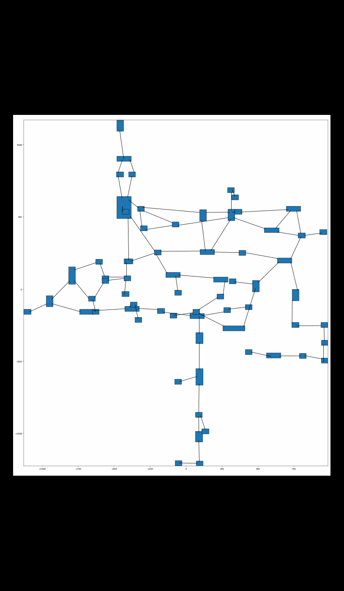
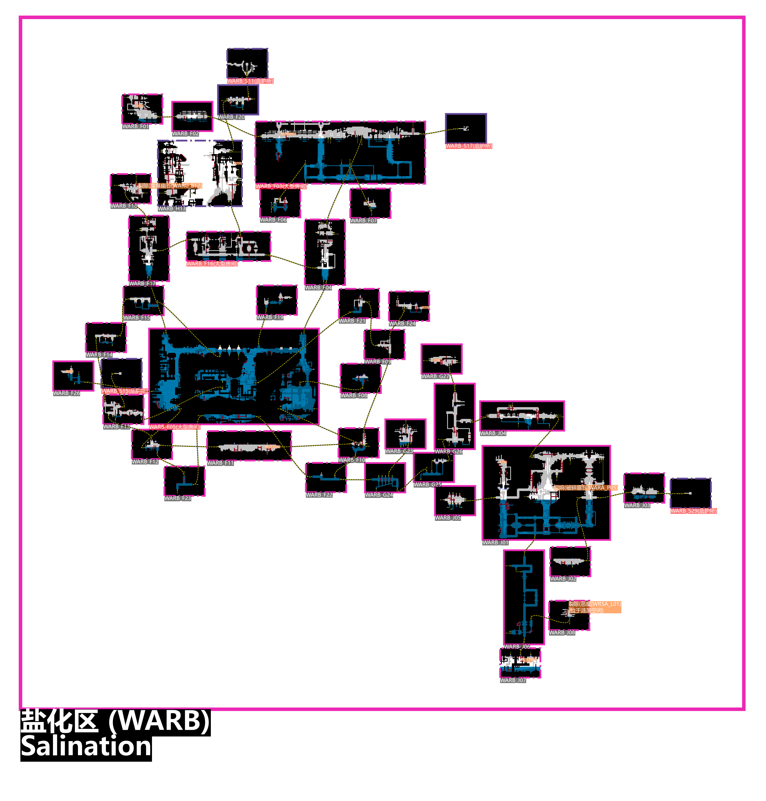

## Watcher Teleportation Overview

## Features

* Automatically arranges map positions based on algorithms
* Rendering support
  * Sand (`TerrainHandle`)
  * Wall-adhering fungus climbable long tentacles (`CorruptionTube`)
  * Acid fluids (`LethalWater` and `Toxic Brine Water`)
  * Air zones in water (`AirPocket`, `WaterCutoff`)
  * Floating water levels (`WaterFluxMinLevel`, `WaterFluxMaxLevel`, `WaterCycleTop`, `WaterCycleBottom`)
* Region support
  * Observer's industrial subregion `Hydroponics`
* Annotations
  * Echo locations
  * Teleport locations
  * Pearl and Karma Flower locations
  * Room types (e.g., `Shelter`)
  * Room numbers

## Notes

* In Watcher, the search order of World files is likely `watcher`, `vanilla`, `moreslugcat`.
* When teleporting from a corrupted vanilla world fissure to the outer expanse, the arrival room is random; `WORA_START` is only one of the possible rooms.
  * The destination room to the Demon region also appears to be random

### TODO

- [ ] Echo teleport location from `WAUA_BATH` to `WAUA_TOYS` is slightly inaccurate

## Links

### Map Generator

* Map editor with UI — [Cornifer](https://github.com/Ved-s/Cornifer)
* [Cornifer](https://github.com/Ved-s/Cornifer) branch adapted for Watcher — [branch](https://github.com/enchanted-sword/Cornifer)

### Map Format Documentation

* [Creating A Region - Rain World Modding](https://rainworldmodding.miraheze.org/wiki/Creating_A_Region)
* [World File Format - Rain World Modding](https://rainworldmodding.miraheze.org/wiki/World_File_Format)
* [Level Editor - Rain World Modding](https://rainworldmodding.miraheze.org/wiki/Level_Editor)

## Reference Effects

### Layout Algorithm Animation

### Sand Rendering

### Air Zones in Water

### Climbable Long Tentacles for Wall-Adhering Fungus

### Floating Water Levels

### Industrial Complex

### Salination Region

